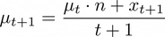
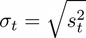
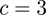

# weather-station-stream-processing

This project implements some data preprocessing and analysis pipelines for a set of streamed weather station datasets 
provided by the National Oceanic and Atmospheric Administration and obtained by the U.S. Climate Reference Network comprising a network of climate monitoring 
stations (https://www.ncei.noaa.gov/pub/data/uscrn/products/subhourly01/2021/).

The project poses and solves four tasks. The first task requires us to implement a stream processing pipeline for computing hourly mean temperatures for the weather station data. 
We implemented the required functionality as well as a final pipeline step for iteratively plotting incoming data which we also used in subsequent tasks. The second task requires implementing a pipeline that
takes a stream of data from three different weather stations and for each hour of data outputs which station measured the highest temperature. We implemented the pipeline and obtained a visualization
of the results. The third task delas with detecting outliers in the data. We implemented an algorithm for marking outliers by observing how many standard deviations from the mean of the data seen so far a 
new data point lies. The result of the implemented pipeline is a stream of weather station data with an additional flag that indicated whether the data point is an outlier or not. Again, we produced a plot of 
the data with outliers marked using the iterative plotting functionality developed as part of the first task. The final task requires us to implement the counting of bucketed values using the Count-min sketch 
algorithm for obtaining approximate counts of unique stream values. We implemented the algorithm and evaluate its performance by comparing the results to exact counts of bucketed values for various 
values of its parameters `w` and `d`. We obtained visualizations of counts obtained by the algorithm and the exact counts which clearly demonstrate that the Count-min sketch never underestimates 
the actual counts of values.

# Cleaning and Pre-Processing Incoming Data Points

The raw points of data put through the stream are presented as whitespace-separated values. An example of a raw data point (broken into two lines) is shown below:
```
26564 20210101 0005 20201231 1505  2.515 -155.75   68.49   -27.4     
0.0      0 0   -27.6 C 0    74 0 -99.000 -9999.0   957 0   0.00 0
```

The datasets' documentation describes the meanings of each field and also provides variable-like names for the fields.
To aid in downstream processing, it is useful to represent this data using some data structure. A good option that allows us to refer to the values by their field names is a simple map that 
can be constructed by parsing these field names and mapping them to the values split by whitespace.

Another useful additional data pre-processing step is to parse the date and time fields and present them in the form of an instance of a date and time encapsulation used to represent such 
data in a particular programming language.

Such annotated and cleaned data points can now be easily queried by any downstream functionality.

# Computing the Hourly Mean Air Temperature

Computing the hourly mean air temperature can be done by first buffering a stream to obtain a batch of measurements for a particular hour. When the first data point for the next hourly batch arrives, 
the current batch is passed forwards and its air temperature field values are averaged to obtain the hourly mean temperature. The figure below shows how buffering is used to compute the hourly mean temperatures. 
When the next data point arrives to the full buffer, the contained batch of data points is passed forward to a node that averages the values for the field of interest. 
The size of the buffer is determined by examining the time granularity of incoming data.


Careful attention must be paid to values signaling an unknown/missing value. We can exclude such values from the mean value computation. If every data point in the batch contains this signal value for our column of 
interest, we can either output a special signal value as the result of our averaging operation or simply output the last previous valid hourly mean.

# Computing The Station with the highest Hourly Measured Temperature

For the task of computing the station with the highest hourly measured temperature, the hourly data buffering idea can be used as well. 
We can use three different buffers that, when filled and a new data point arrives, output the maximum value of the field of interest. 
These outputs can then be compared to determine the station with the highest measurement. The figure below visualizes this idea.


# Detecting Outliers in the Data Stream

Outlier detection in data streams is an active research field with many applications and methodologies. One way to try to detect data points that are outliers is to 
keep track of the mean and variance of the data points seen so far and compute how many standard deviations away from the current mean a newly arrived data point lies. 
A common criterion is to classify each data point that is more than 3 standard deviations away from the mean as an outlier. We can reformulate the standard equations 
for the mean and variance to make them depend on the newly computed data point and their previous values so that all the previously seen data points need not be stored. 
The first equation below shows the standard formula for computing the mean of a set of values. the second equation below shows how this formula can be rewritten so that 
the computation of the mean for the same set of data points with an additional new data point depends only on the mean of the original set of values and on the newly 
arrived value. The only thing we need to keep track of is the count of the data points seen so far.




We can reformulate the variance equation in a similar way. The equation below shows the standard formula for computing the variance of a set of values.


The standard deviation can be computed from the variance by simply taking the square root of the value as shown below.



These values can then be used to classify an incoming data point as either being an outlier or not depending if the following formula 
holds: . The standard deviation multiplier is commonly set as .

# Counting Bucketed Values Using the Count-Min Sketch Algorithm

The Count-min sketch algorithm uses a special data structure with a user-defined fixed size memory footprint to track approximate counts of 
unique values seen in the data. It works by incrementing cells in a `w` by `d` matrix where each row is associated with a hash function that is independent 
of the hash functions associated with the other rows. An incoming value is hashed with each hash function and the resulting hash value is used to get the index 
of the column of the cell to increment for that particular row. When querying for the count of a particular value, the indices of columns for each row are computed 
in the same manner as when performing the incrementations. The minimum value found in the corresponding cells is selected as the count approximation for the query. 
It can be shown that these approximated counts are always equal to or greater than the actual exact count. The figure below shows an example of the matrix 
used to hold the count approximations with the appropriate cells incremented after processing the first value.


# Using the Developed Implementations

This package offers a command-line interface that allows the user to choose the functionality for a specific task and to control various other parameters.

run `pip -r requirements.txt` to install the requirements.

Running `python3 weather-station-stream-processing --help` prints the instructions on how to customize
the parameters of the implementation when running:
```
usage: weather-station-stream-processing [-h] [--task {1,2,3,4}] [--dataset-path DATASET_PATH [DATASET_PATH ...]] [--plot-dir-path PLOT_DIR_PATH] [--no-title] [--w W] [--d D]

optional arguments:
  -h, --help            show this help message and exit
  --task {1,2,3,4}      task to compute - see README for more information
  --dataset-path DATASET_PATH [DATASET_PATH ...]
                        path to dataset(s) to use
  --plot-dir-path PLOT_DIR_PATH
                        path to folder in which to save plots
  --no-title            omit title from plots
  --w W                 the w parameter for the Min-count sketch algorithm
  --d D                 the d parameter for the Min-count sketch algorithm
```

# Implementation of the Computation of the Hourly Mean Air Temperature
The figure below shows the structure of the implemented pipeline for the 1. task. The data points are first mapped to a dictionary mapping column names to the 
corresponding values. The `partition` function is used to implement the data point buffering. Next, the pipeline is split. The left side includes a mapping of the 
date and time fields to a Python's `datetime.datetime` instance representing the date and time of the batch. The right side extracts the value of the field of 
interest and computes the means. The results of the branches are joined to form a stream of tuples of the hourly mean air temperature and the corresponding date 
and time value.


The figure below shows the plotted hourly mean air temperatures for a chosen dataset.


# Implementation of the Computation of the Station with the highest Hourly Measured Temperature

The pipeline implemented to solve the 2. task is shown in the figure below. The streams from the three 
different stations are buffered and the maximum value of each is computed. Next, the index of the station with the maximal measurement is computed and 
is joined with the branch computing the date and time for the batches.


The figure below shows the stations which had the highest measurement for each hourly batch of data.


## Implementation of the Detecting of Outliers in the Data Stream

The pipeline implemented to solve the 3. task is shown in the figure below. The three branches into which the pipeline splits deal with mapping date and time 
columns, extracting the value of interest, and computing the flag specifying whether the value is classified as an outlier or not based on the mean and standard deviation 
of the data points observed so far.


The figure below shows the temperatures for a chosen dataset with the detected outliers marked in green.


## Implementation of the Counting of Bucketed Values Using the Count-Min Sketch Algorithm

The pipeline implemented to solve the 4. task is shown on the figure below. The data is branched to either an implementation of the Count-min sketch algorithm or 
to an implementation of exact counting. We used the MurmurHash hash functions initialized with random seeds in our implementation.


The results of running the pipeline are then used to compare the performance of the Count-min sketch algorithm to the exact counts. 
The figure below shows a side-by-side comparison of the counts of bucketed values for a Count-min sketch implementation with `w` set to 4 
and `b` set to 5.


By modifying the two hyperparameters of the Count-min sketch algorithm and observing the side-by-side comparisons, we can note that the counts produced by the 
Count-min sketch algorithm are always greater or equal to the actual counts.
